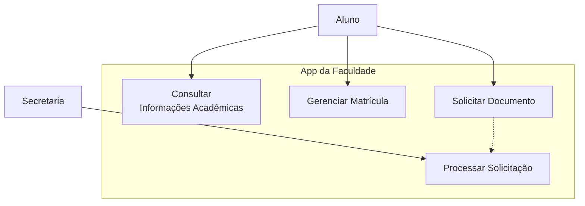

# Siga-Prototipo

Este projeto tem como objetivo desenvolver um aplicativo móvel para auxiliar alunos no acesso a informações acadêmicas e realização de solicitações administrativas de maneira segura e intuitiva.

---

## Etapa 1 – Requisitos e Casos de Uso

### Atores

- **Aluno**: Usuário principal. Consulta informações acadêmicas e realiza solicitações.
- **Secretaria**: Responsável por processar as solicitações feitas pelos alunos.

### Requisitos Funcionais (RF)

- **RF01**: Autenticação de usuário (login, recuperação de senha, primeiro acesso).
- **RF02**: Consulta de notas, faltas, horários e histórico.
- **RF03**: Acesso a materiais de aula.
- **RF04**: Solicitações (matrícula, trancamento, emissão de documentos).
- **RF05**: Recebimento de notificações.

### Requisitos Não Funcionais (RNF)

- **RNF01**: Resposta abaixo de 3 segundos.
- **RNF02**: Interface intuitiva.
- **RNF03**: Dados criptografados e conformidade com a LGPD.
- **RNF04**: Disponibilidade de 99.5%.
- **RNF05**: Compatível com Android e iOS recentes.

### Diagrama de Casos de Uso 

### 📝 Exemplo de Caso de Uso: Solicitar Documento

1. Aluno acessa o app e vai para "Secretaria Virtual".
2. Escolhe "Solicitar Documento" → "Atestado de Matrícula".
3. Solicitação marcada como "Em Processamento".
4. Secretaria processa o pedido e status muda para "Disponível".
5. Aluno recebe notificação e baixa o PDF.

---

## 🎨 Etapa 2 – Interface

### 🧭 Telas Principais

- **Login**: Campos de RA e senha.

- **Esqueceu a Senha ou Primeiro Acesso**: Para Criar uma nova Senha ou Criar a Primeira senha da Conta.

- **Home**: Tela principal do app.

- **Matricula**: Central de serviços administrativos referente a matriculas.

- **Materias**: Mostra a frequencias e Notas das Materias Matriculadas no Semestre atual.

- **Historico**: Mostra a frequencias, Notas e Materias por Semestres.

